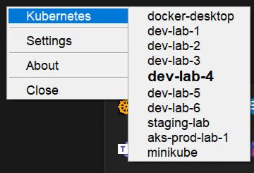

[float]
= Java SystemTray Kubernetes Context Selector Application.
:doctype: article
:encoding: utf-8
:lang: en
:toc: left

:description: KubeTray is a simple Java Swing Windows System Tray application for selecting the default Kubernetes context.
:author: Sangramsing
:keywords: kubernetes, kubernetes utilities for context switching, kubernetes tools, kubernetes contexts switch

== About

[float]
==== A simple Java Swing/AWT based Windows System Tray application for selecting the default Kubernetes context.This simple easy to use application will help developers and devops engineers working on especially multiple K8s Clusters like prod, staging, dev and local environment where we frequently need to switch the K8s Context for running kubectl commands.

++++
<a class="view-github" href="https://github.com/sangramsin9/kubetray">View on Github</a>

++++

== Demo
.KubeTray System Tray Icon in Windows System Tray
image::src/main/resources/images/k8s_tray_demo.png[]

.KubeTray System Tray Icon showing all the Kubernetes Contexts

== How to install
You can run it by executing the KubeTray.exe file, once successfully launched it show you system tray icon for KubeTray app. You are all set!

==== Run on JVM
[source,bash]
----
git clone https://github.com/sangramsin9/kubetray.git
cd kubetray
mvn clean install
cd target
java -jar kubetray.jar
----

==== Run as EXE
[source, cmd]
----
git clone https://github.com/sangramsin9/kubetray.git
cd kubetray
mvn clean install
cd target
Execute KubeTray.exe for Windows CMD use: start KubeTray.exe
----
