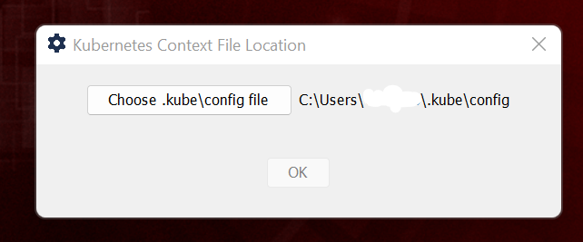

[float]
= Java SystemTray Kubernetes Context Selector Application.
:doctype: article
:encoding: utf-8
:lang: en
:toc: left

:description: KubeTray is a simple Java Swing Windows System Tray application for selecting the default Kubernetes context.
:author: Sangramsing
:keywords: kubernetes, kubernetes utilities for context switching, kubernetes tools, kubernetes contexts switch

== About

[float]
==== A simple Java Swing/AWT based Windows System Tray application for switching the Kubernetes (cluster) contexts faster.

[float]
==== Easy to use, faster Kubernetes Context Selector tool will help developers and devops engineers working on multiple Kubernetes Clusters.

++++
<a class="view-github" href="https://github.com/sangramsin9/kubetray">View on Github</a>

++++

== Demo

.KubeTray System Tray Icon in Windows System Tray
image::src/main/resources/images/k8s_tray_demo.png[]

.KubeTray System Tray Icon showing all the Kubernetes Contexts
image::src/main/resources/images/k8s_tray_demo_2.png[]

.Option to configure .kube/config location other than default minikube / kubernetes location.

== How to install
Following below step will help you to build KubeTray.exe / kubetray.jar locally.

====== Run on JVM
[source,bash]
----
git clone https://github.com/sangramsin9/kubetray.git
cd kubetray
mvn clean install
cd target
java -jar .\kubetray-0.0.1-jar-with-dependencies.jar
----

====== Run as EXE
[source, cmd]
----
git clone https://github.com/sangramsin9/kubetray.git
cd kubetray
mvn clean install
cd target
start KubeTray.exe
----
