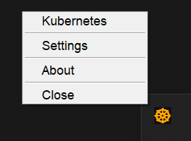
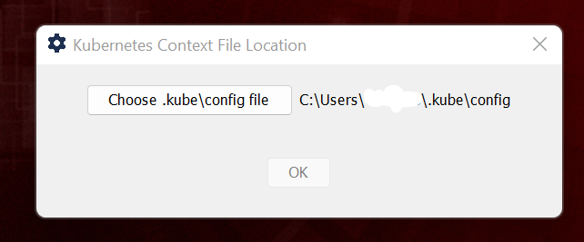

**Kubernetes Context Selector Java SystemTray Application**

---

## About

**A simple Java Swing/AWT based Windows System Tray application for
switching the Kubernetes (cluster) contexts faster.**

**Easy to use, faster Kubernetes Context Selector UI.**

**KubeTray context switching UI can help Developer and DevOps engineers
working on multiple Kubernetes Clusters.**

<div align="right">
  <a href="https://github.com/sangramsin9/kubetray">View on GitHub</a>
</div>

---

## Demo

<figure>
  
  <figcaption>Figure 1: KubeTray System Tray Icon in Windows System Tray.</figcaption>
</figure>

<figure>
  
  <figcaption>Figure 2:KubeTray System Tray Icon showing all the Kubernetes Contexts.</figcaption>
</figure>

<figure>
  
  <figcaption>Figure 3: Option to configure .kube/config location other than default minikube / kubernetes location.</figcaption>
</figure>

---

## How to install

Following below step will help you to build KubeTray.exe / kubetray.jar
locally.

#### Run on JVM

``` bash
git clone https://github.com/sangramsin9/kubetray.git
cd kubetray
mvn clean install
cd target
java -jar .\kubetray-0.0.1-jar-with-dependencies.jar
```

#### Run as EXE

``` cmd
git clone https://github.com/sangramsin9/kubetray.git
cd kubetray
mvn clean install
cd target
start KubeTray.exe
```
